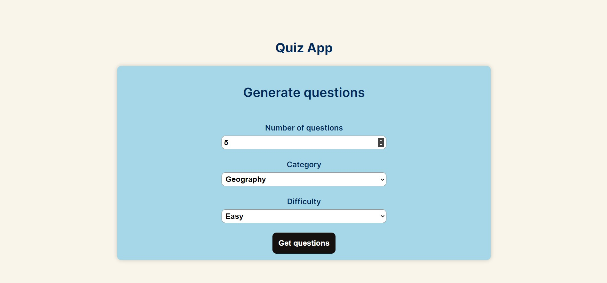
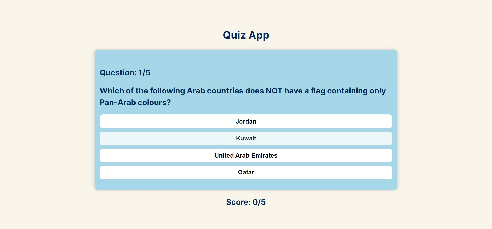
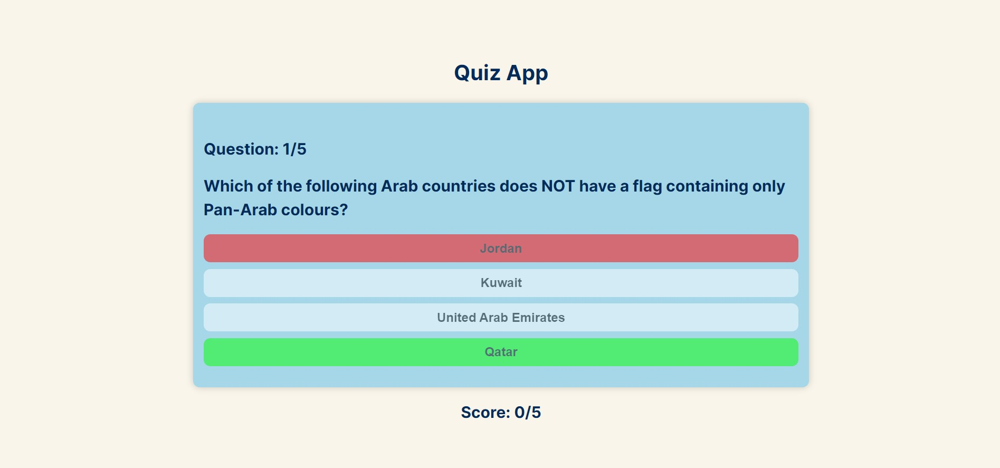

In March 2023 I attended a 2-month long React education at [Digitalna Dalmacija](https://digitalnadalmacija.hr/). The education lasted for 8 weeks, and every week I was required to build a new project. This is the projects I build in the 4th week.

## Table of contents

- [Challenge](#challenge)
- [Screenshot](#screenshot)
- [Links](#links)
- [Built with](#built-with)
- [What I learned](#what-i-learned)

### Challenge

The task was to build a quiz app in React. The user can choose what type of questions and how many he wants and then generate a quiz with those questions. He then can answer those questions with real-time scores and feedback on each question.

### Screenshot

### Links

- Live Site URL: https://quiz-app-jure-reljanovic.netlify.app/

### Built with

- [React](https://reactjs.org/)
- Axios

### What I learned

This project was one of my favorite ones I made at Digitalna Dalmacija because it got me feeling for the first time that I have built something ready to use. Something that works as described and it's fun to use.

I learned how to utilize the useEffect hook, and how to manipulate component state to provide instant feedback to the user. I also learned how to use Axios to fetch data from an API.
